  <picture>
    <source media="(max-width: 600px)" srcset="assets/header-mobile.svg?v=4"/>
    
  </picture>

  Building <b>VEYLO</b>, my own VPN service: servers, clients, transports. 
  Also Telegram bots and games for Yandex Games.

<h3 align="center">Stack</h3>

  <picture>
    <source media="(max-width: 600px)" srcset="assets/stack-mobile.svg"/>
    
  </picture>

<h3 align="center">Projects</h3>

  <picture>
    <source media="(max-width: 600px)" srcset="assets/projects-mobile.svg?v=2"/>
    
  </picture>

<h3 align="center">Activity</h3>

  <picture>
    <source media="(max-width: 600px)" srcset="https://raw.githubusercontent.com/MostViable/MostViable/output/stats-mobile.svg?v=7"/>
    
  </picture>

  <picture>
    <source media="(max-width: 600px)" srcset="https://raw.githubusercontent.com/MostViable/MostViable/output/calendar-mobile.svg?v=8"/>
    
  </picture>

<h3 align="center">Contact</h3>

  <a href="https://t.me/MostViable">
  <picture>
    <source media="(max-width: 600px)" srcset="assets/contact-mobile.svg"/>
    
  </picture>
  </a>

